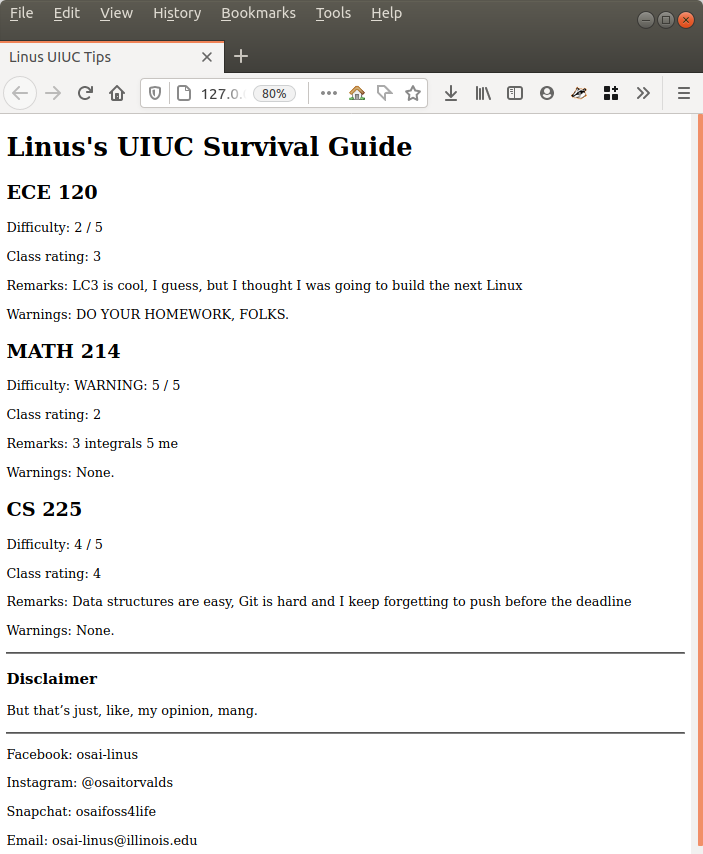
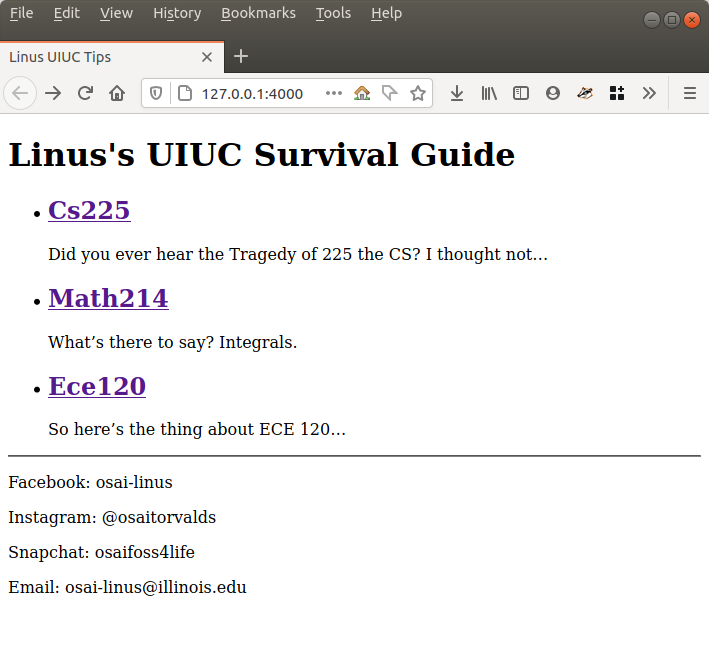
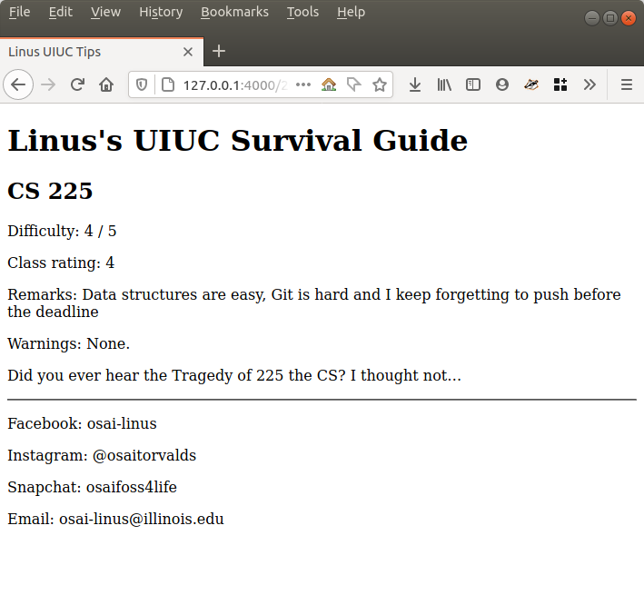

## Exercise 4.1: Why don't we take our data, and push it somewhere else!?

Readings:
- [Part 6](https://jekyllrb.com/docs/step-by-step/06-data-files/)

So, let's say on this website, you also wanted to put some of your social media so that people who benefited from your website can see what you've been up to. But, where do we put our handles and usernames?

Moreover, how are we going to access that data from multiple places on the website?

There are two approaches: one is using `_config.yml`, which is a special file at the root of the directory for site-wide configurations. However, this is really inconvenient for development: `jekyll serve` will NOT automatically refresh if you make changes to your `_config.yml`. This makes debugging insane. Trust me, I know. So, we're going to reserve `_config.yml` for *actual* site configurations and not for simple text stuff like social media handles. 

For our social medias, we're going to use one of Jekyll's magic directories: `_data`. We can put all of our class data in a file under this directory, say for example `_data/social.yml`, like so:

### /_data/social.yml

```yaml
facebook: osai-linus
instagram: "@osaitorvalds" # In YAML, if your string has an @ sign in the beginning, you need to put the string in quotes
snapchat: osaifoss4life
email: osai-linus@illinois.edu
```

, and then we can access this data by using the Liquid variable `site.data.social`. Because the `social.yml` file is located in `_data`, it is available site-wide as `site.data.social`. Contrast this to `page.classes`, which is in `index.md`: because the `classes` YAML entry is defined in the front matter of the page `index.md`, it is available under the `page` variable and not the `site.data` variable.

Go ahead and complete the refactor: make a new directory `_data` and a new file `_data/social.yml`, move all the data into `_data/social.yml`, and update your `_layouts/default.html` to have a horizontal rule element (`<hr/>`) and then your social handles at the bottom of the webpage as a bunch of `<p>` tags -- by the end, your browser should look like this:




By the end, this is what your directory structure should look like:

```
.
├── about.md
├── _data
│   └── social.yml
├── Gemfile
├── Gemfile.lock
├── index.md
└── _layouts
    ├── default.html
    └── ratings.html
```

To test your `index.html`, run `jekyll serve`, or if that's not working, run `bundle exec jekyll serve`.

When you're ready, keep reading.

## Exercise 4.2: Posts, at last!

Readings:
- [Part 8](https://jekyllrb.com/docs/step-by-step/08-blogging/)

Currently, we just list all of the classes we've taken so far on the front page. While this is certainly an approach, this is not exactly scalable -- after all, we're going to be at UIUC for a while, and we'll be taking a good amount of courses. So, what do we do?

Conveniently, Jekyll has this notion of "posts". Posts are subpages in your site, kind of like what blog posts might be. Posts live in the magic Jekyll directory `_posts` in the root of your directory, and each file has the special (and mandatory) format `YYYY-MM-DD-title.md`. Jekyll will pull the post title and date from the filename, and it will get all the other necessary data from the post file contents.

Posts are part of what make Jekyll great for things like keeping track of recipes, book reports, blogging, and whatnot. So, let's get to it!

Step 1 is to split the "classes" YAML entry in `index.md` into three different files, and set the layout to "ratings" in the frontmatter:

### /_posts/2020-11-09-ECE120.md

```
---
layout: ratings
name: ECE 120
rating: 3
difficulty: 2
remarks: LC3 is cool, I guess, but I thought I was going to build the next Linux
warnings: Do your homework, folks.
---

So here's the thing about ECE 120...
```

### /_posts/2020-11-10-MATH214.md

```
---
layout: ratings
name: MATH 214
rating: 2
difficulty: 5
remarks: 3 integrals 5 me
---

What's there to say? Integrals.
```

### /_posts/2020-11-11-CS225.md

```
---
layout: ratings
name: CS 225
rating: 4
difficulty: 4
remarks: Data structures are easy, Git is hard and I keep forgetting to push before the deadline
---

Did you ever hear the Tragedy of 225 the CS? I thought not...
```

Step 2 is to change the ratings layout so that it no longer iterates through the classes variable, and instead, it just takes the data from the page itself. 

(Hint: this involves removing the "for" loop and changing the variable names: hint 2: where do the variables come from? The `page` or the `site`?)

Step 3 is to create a new layout `_layouts/home.html` based on the default layout so that we can put a link to each post!

By the end, your homepage should look something like this:



And each post should look something like this -- example for the CS225 page:




By the end, your file structure should look something like this:

```
.
├── about.md
├── _data
│   └── social.yml
├── Gemfile
├── Gemfile.lock
├── index.md
├── _layouts
│   ├── default.html
│   ├── home.html
│   └── ratings.html
└── _posts
    ├── 2020-11-09-ECE120.md
    ├── 2020-11-10-MATH214.md
    └── 2020-11-11-CS225.md
```

To test your `index.html`, run `jekyll serve`, or if that's not working, run `bundle exec jekyll serve`.
When you're ready, keep reading.

